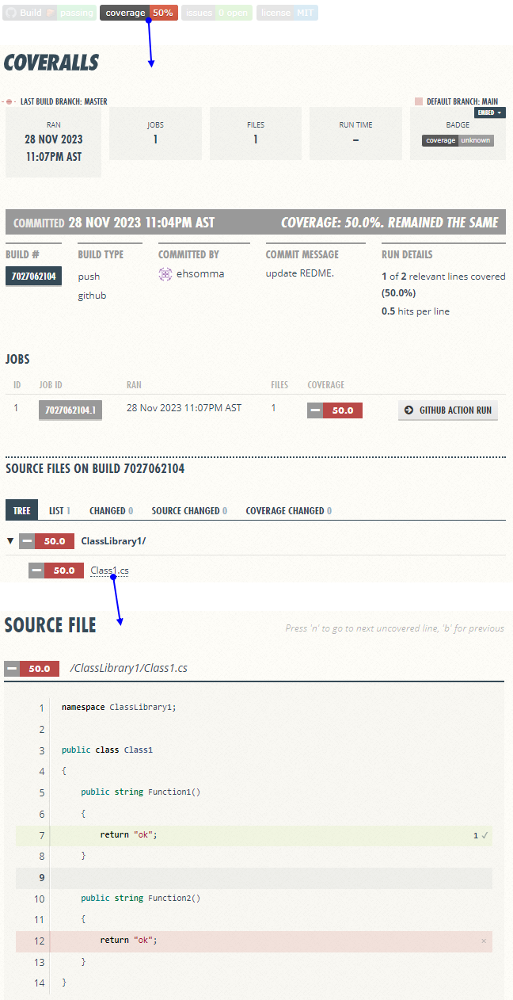

# Dotnet code coverage (badge and report)

This project shows how to use code coverage in dotnet and how you can publish the results in the repo readme with badges. 

It uses code coverage (in "Cobertura" format) with Github Actions and Coveralls. <a href="https://coveralls.io" target="_blank">Coveralls</a> will read the covertura.xml and will generate the coverage result badge and a beautiful and detailed report of the coverage. Then it will automatically updated with each push (you can modify it to run on pull request).

## About the Project

The solution contains two projects, each of which includes a class with two functions. In the first project, only the first function is tested to achieve a 50% code coverage. The second project is completely excluded from code coverage as an example.

## How to Test It

1. Create an account on Coveralls by going to <a href="https://coveralls.io" target="_blank">coveralls.io</a> and registering with your GitHub account (it is **free** for public repos!). Coveralls will request permission to view your public repositories.
2. Create a new `public` repository on GitHub.
3. Access Coveralls and select the `(+)ADD REPOS` option.
4. Search for your new repository (if you can't find it, click the `SYNC REPOS` button) and switch the repository toggle (`ON/OFF`) to ON in the repos list.
5. Download the code from this repository.
6. Open the `README.md` file and replace "*ehsomma/DotnetCodeCoverage*" with your repository's data (\<your-githug-user\>/\<repo-name\>) in all the links.
7. Push the code to your new repository (the one you just connected to Coveralls).

After pushing, the pipeline (GitHub Actions) will run, when it finished, you will see the code coverage badge with a link to the report in the `README.md` file as at the top of this document.

